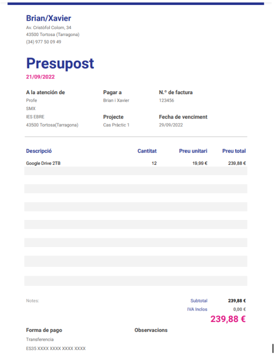
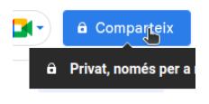
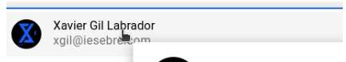
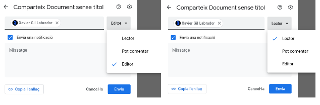
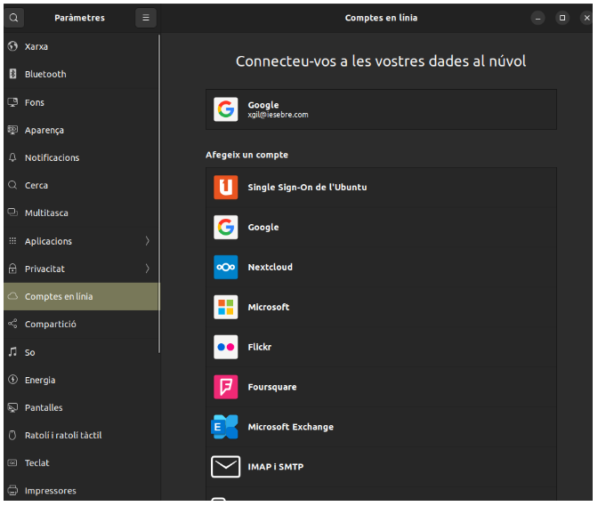

# CAS PRÀCTIC 1

### · Perquè penseu que aquesta és una bona solució al nostre problema.
- Pensem que és una bona solució ja que implementem l'emmagatzematge al núvol el qual afegeix una capa de seguretat i una altra alternativa. A més si utilitzem google drive es un entorn el qual segurament molts dels nostres empleats ya tinguin nocions bàsiques de com utilitzar-lo, en el cas de que no el sàpiguen fer servir és molt intuitiu i al principi de la creació del comte et fa un mini tutorial indicant les coses de la propia interficie.

### · El pressupost mensual i anual de la despesa del servei a contractar.

### · Guia de creació de les unitats compartides BACKUP i DOCUMENTS on es vegin els permisos assignats a cada tipus d’usuari/a.
- Amb el cas de la backup al windows a la rodeta de ajustes ens surt per a descargar la copia de seguretat en canvi al ubuntu lo que es pot fer es connectar la cuenta de google, i llavors al lloc de les carpetes baix de tot et sortirà un apartat on et surt el correu de la còpia de seguretat, sinó la ultima opció seria passar-ho tot a una carpeta del google drive i descargarla.

- Primer que tot per a compartir un document haurem de sel·leccionar el següent botó que està situat dalt a la dreta.

- El següent pas serà decidir en qui compartir l’arxiu, escriurem el seu correu i el sel·leccionarem.

- Seguidament anirem a canviar-li el permís, s’haura de clicar al botó on posa editor i sel·leccionar el permís que li volguéssim asignar.

### · Guia d’instal·lació d’adreces directes als escriptoris dels dos tipus d’usuaris: Administrador/a i usuari/a.
- Primer anem a la part superior dreta i entrem a paràmetres.

- Després entrem a Comptes en línia i afegim el nostre compte de correu electrònic. 
- Depenent del que utilitzem ens sortirà una opció o una altra, simplement tindrem d’iniciar sessió, es fa de la mateixa forma tant en d'administradors com usuaris.

