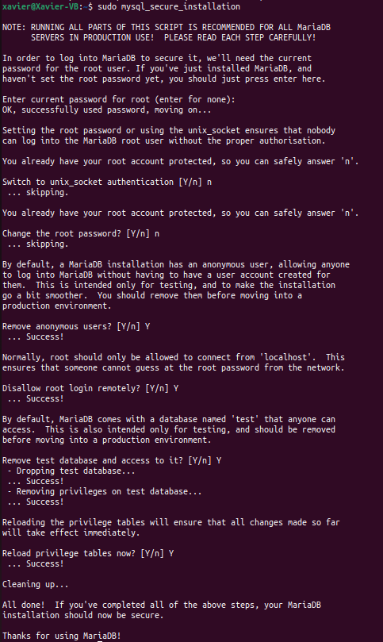
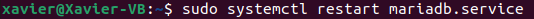

# Instal·lar Owncloud a Ubuntu 22.04 LTS
29 Set. 2022

## Requisits previs
Abans de poder instal·lar Owncloud al nostre equip amb Ubuntu hem de tenir instal·lat LAMP, per això pots consultar el tutorial per instal·lar LAMP a Linux.

## Instal·lar Apache:
Instal·lem el servidor Apache:

```
sudo apt install apache2
```


Desactivem el llistat de directoris del servidor:

```
sudo sed -i "s/Options Indexes FollowSymLinks/Options FollowSymLinks/" /etc/apache2/apache2.conf
```


## Instal·lar MariaDB:
Instal·lem MariaDB:

```
sudo apt-get install mariadb-server mariadb-client -y
```


I configurem la instal·lació:

```
sudo mysql_secure_installation
```


Per ultim reiniciem el servidor MariaDB

```
sudo systemctl restart mariadb.service` o `sudo service mariadb.service restart
```

