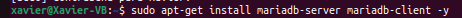
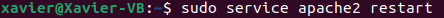

# Instal·lar Owncloud a Ubuntu 22.04 LTS
29 Set. 2022

## Requisits previs
Abans de poder instal·lar Owncloud al nostre equip amb Ubuntu hem de tenir instal·lat LAMP, per això pots consultar el tutorial per instal·lar LAMP a Linux.

## Instal·lar Apache:
Instal·lem el servidor Apache:

```
sudo apt install apache2
```


Desactivem el llistat de directoris del servidor:

```
sudo sed -i "s/Options Indexes FollowSymLinks/Options FollowSymLinks/" /etc/apache2/apache2.conf
```

sudo mysql -u root -p
## Instal·lar MariaDB:
Instal·lem MariaDB:

```
sudo apt-get install mariadb-server mariadb-client -y
```


I configurem la instal·lació:

```
sudo mysql_secure_installation
```


Per ultim reiniciem el servidor MariaDB

```
sudo systemctl restart mariadb.service` o `sudo service mariadb.service restart
```


## Creació Base de Dades Ownclowd:

Entrem a MariaDB:

```
sudo mysql -u root -p
```


Creem la base de dades:

```
CREATE DATABASE owncloud;
```


Creem un usuari anomenat ownclouduser amb una contrasenya que podria ser Admin1234:

```
CREATE USER 'ownclouduser'@'localhost' IDENTIFIED BY 'Admin1234';
```


Donem accés a l'usuari a la base de dades creada:

```
GRANT ALL ON owncloud.* TO 'ownclouduser'@'localhost' IDENTIFIED BY 'Admin1234' WITH GRANT OPTION;
```


Apliquem cambis i guardem:

```
FLUSH PRIVILEGES;
EXIT;
```


## Instal·lar PHP i moduls nesecaris:

Comanda per instal·lar:

```
sudo apt-get install software-properties-common -y
sudo add-apt-repository ppa:ondrej/php
```
Actualitzarem els paquets del repositori afegit:

```
sudo apt update
```

Instal·lació PHP i moduls nesecaris:

```
sudo apt install php7.4 libapache2-mod-php7.4 php7.4-common php7.4-mbstring php7.4-xmlrpc php7.4-soap php7.4-apcu php7.4-smbclient php7.4-ldap php7.4-redis php7.4-gd php7.4-xml php7.4-intl php7.4-json php7.4-imagick php7.4-mysql php7.4-cli php7.4-mcrypt php7.4-ldap php7.4-zip php7.4-curl -y
```

Després de la instal·lació editem el fitxer php.ini i canviarem alguns valors:

```
sudo nano /etc/php/7.4/apache2/php.ini
```
Per trobar els parametres usem la comanda Ctrl + W

Els valors que hem de canviar són els següents:
- file_uploads = On
- allow_url_fopen = On
- memory_limit = 256M
- upload_max_filesize = 100M
- display_errors = Off
- date.timezone = Europe/Madrid
  
## Instal·lem Owncloud:
  
Descarreguem la darrera versió del programa i descomprimim els fitxers, a més movem els fitxers d'Owncloud a "/var/www/html/owncloud":
  
```
cd /tmp && wget https://download.owncloud.com/server/stable/owncloud-complete-latest.zip
unzip owncloud-complete-latest.zip
sudo mv owncloud /var/www/html/owncloud/
```

Canviem el propietari i permisos dels directoris d'owncloud. www-data perquè els pugui fer servir Apache, 755 perquè els pugui executar i llegir qualsevol usuari de Linux:

```
sudo chown -R www-data:www-data /var/www/html/owncloud/
sudo chmod -R 755 /var/www/html/owncloud/
```


## Configurar Apache:

Configurem Apache:

```
sudo nano /etc/apache2/sites-available/owncloud.conf
```
Hem de deixar un fitxer com el següent, però canviant el ServerName i el ServerAlias pels noms i àlies del nostre propi domini.


Habilitem owncloud i el mòdul rewrite:

```
- sudo a2ensite owncloud.conf
- sudo a2enmod rewrite
- sudo a2enmod headers
- sudo a2enmod env
- sudo a2enmod dir
- sudo a2enmod mime
```


Reiniciem Apache:

```
sudo service apache2 restart
```


Ara per accedir busquem al nostre navegador web el domini que hem establert en el meu cas owncloud.xgl.com 


